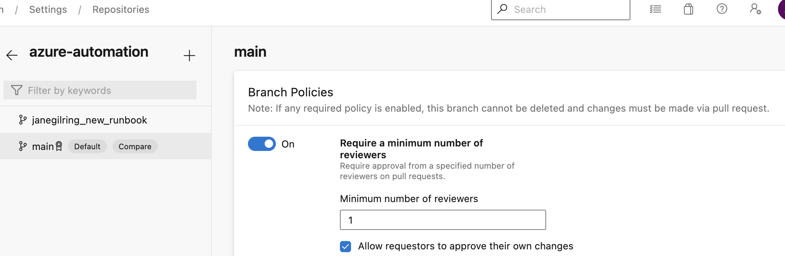
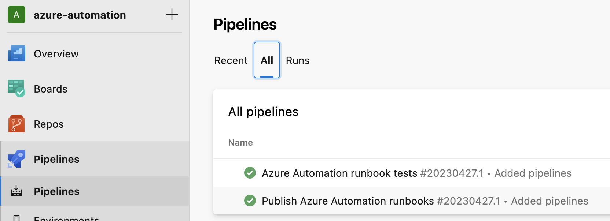
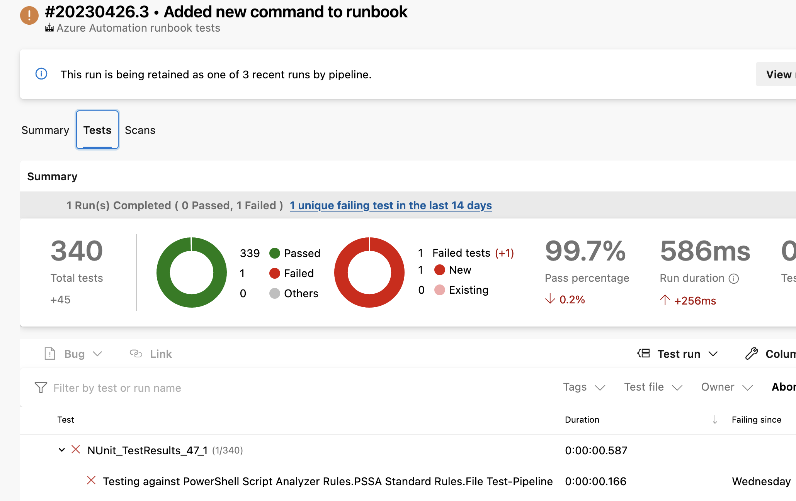
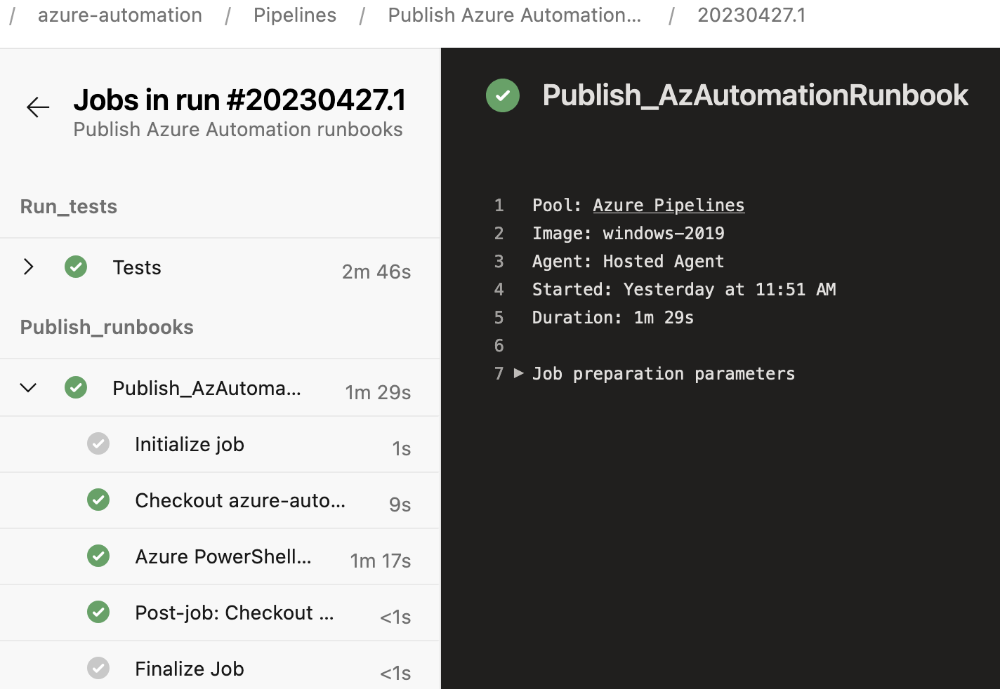
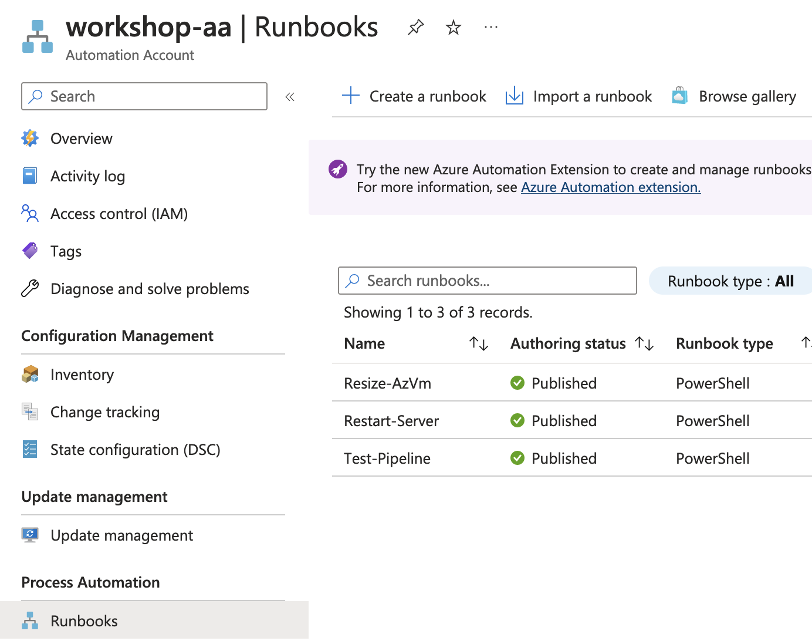

# Introduction

Demo of configuring Azure Automation runbooks with CI/CD based deployments

# Azure DevOps

1) Create a new project in Azure DevOps
2)Clone this repository and add it to Azure Repos in Azure DevOps in the newly created project
3) Configure a branch policy on the main branch to prevent push to this branch, as we want all code changes to go via Pull Requests:

4) Configure a Service Connection in the Azure DevOps project with necessary permissions to publish runbooks to the target Azure Automation account
5) Import the two pipelines in the /Pipelines folder:
- pull_request.yml
    - This will trigger on new Pull Requests to the main branch and run PS Script Analyzer tests against all .ps1 files in the /Runbooks directory
- publish.yml
    - This will publish all .ps1 files in the /Runbooks directory to the Azure Automation account specified
    - Update **azureSubscription** on line 15 to reflect the name of the Service Connection in your project
    - Update **$AutomationAccount** and **$ResourceGroup** on line 19 and 20 to reflect your environment

At this point you should have 2 pipelines configured:

To test the development flow:
- Create a new branch.
- Add a .ps1 file in the Runbooks folder
- Commit the newly added file
- Create a Pull Request against the main branch

The pipeline **Azure Automation runbook tests** should now be automatically triggered.

Any failed tests can be found on the Tests tab for the pipeline run:

After resolving any issues detected by the automated tests, complete and merge the pull request into main.

The pipeline **Publish Azure Automation runbooks** should now be automatically triggered.

After the pipeline has completed, you should see all ps.1 files in the /Runbooks folder added as runbooks in the configured Azure Automation account:

# GitHub

TODO: Add pipeline file and steps for using GitHub Actions